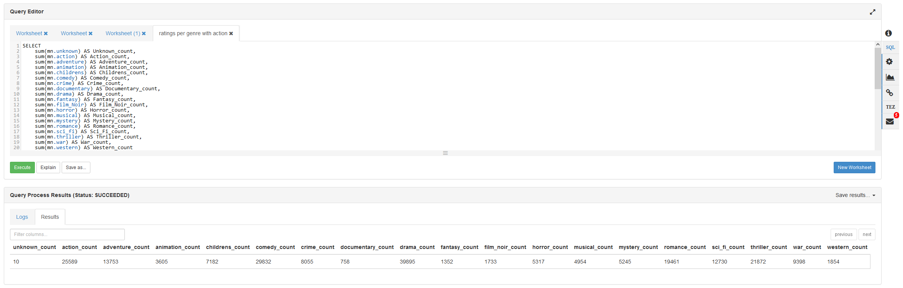

# **Assignment 1 – Parallel Distributed Processing**

## <a name="1."></a>**1. Student details**

|        |                                                                                          |
|:-------|:-----------------------------------------------------------------------------------------|
|Naam:   |Jasper Stedema                                                                            |
|Nummer: |621642                                                                                    |
|Github: |<https://github.com/ditislol10/Inholland-P4.4-Parallel-Distributed-Processing-Assignments>|

## <a name="2."></a>**2. Prerequisites**

- Knowledge of:
  - Python, MapReduce and MRJob
- Programs installed:
  - WinSCP, PuTTY, Oracle VM VirtualBox
- Basic set-up of the following: (recommended)
  - Hadoop sandbox 2.5 VM
  - Python3.8 with packages
    - Pip
    - MRJob

## <a name="3."></a>**3. Preparations**

These are the commands I have used to prepare the sandbox, so it is actually usable.  Since the sandbox is drastically out-dated.<br>
Like... Windows XP out-dated :')

The steps to get everything working came to fruition from a lot of trail and error, and eventually some inspiration from [this tutorial](https://serverok.in/install-python-3-8-on-centos-6-from-source) from Serverok, which helped a lot but it didn't cover every aspect!

### <a name="3.1."></a>**3.1. Replace Registries**

```bash
# Because the default repositories are outdated we have to replace them.
rm ./etc/yum.repos.d/* # Delete all default repositories
cd ./etc/yum.repos.d/ # Check if they are all deleted 
```

```bash
# Download the new repositories and clean the registry
curl https://www.getpagespeed.com/files/centos6-eol.repo --output /etc/yum.repos.d/CentOS-Base.repo
curl https://www.getpagespeed.com/files/centos6-epel-eol.repo --output /etc/yum.repos.d/epel.repo
yum clean all
```

### <a name="3.2."></a>**3.2. Updating packages**

```bash
# Try to update all the packages, there is a possibility that mysql-libs struggles, as it gives duplication errors
yum update
yum install yum-utils # Install yum-utils
package-cleanup --dupes # Take care of dupes
kill -9  [process_id_of mysql] #search the 
yum update --exclude=mysql-libs
```

### <a name="3.3."></a>**3.3. Installing and configuring OpenSSL**

```bash
# From the following tutorial
# https://serverok.in/install-python-3-8-on-centos-6-from-source
# first install newer OpenSSL as the default one is outdated
cd /usr/local/src
wget https://www.openssl.org/source/openssl-1.1.1g.tar.gz --no-check-certificate
tar xvf openssl-1.1.1g.tar.gz
cd openssl-1.1.1g
./config --prefix=/usr/serverok/openssl --openssldir=/usr/serverok/openssl no-ssl2
make
make install
```

### <a name="3.4."></a>**3.4. Editing the file `'~/.bash_profile'`**

```bash
# Edit the file bash_profiles
vi ~/.bash_profile
```

```bash
# instead of the tutorial replace everything under the "# User specific environment and startup programs"
# with this:
PATH=$PATH:$HOME/bin:/usr/local/bin:/usr/serverok/openssl/bin

export PATH
export LD_LIBRARY_PATH=/usr/serverok/openssl/lib
export LC_ALL="en_US.UTF-8"
export LDFLAGS="-L/usr/serverok/openssl/lib -Wl,-rpath,/usr/serverok/openssl/lib"
# till here
```

```bash
#then save the file and activate the settings
source ~/.bash_profile
```

### <a name="3.5."></a>**3.5. Installing Python 3.8**

```bash
# now install python 3.8
cd /usr/local/src
wget https://www.python.org/ftp/python/3.8.4/Python-3.8.4.tar.xz
tar xvf Python-3.8.4.tar.xz
cd /usr/local/src/Python-3.8.4
./configure --enable-optimizations  --with-openssl=/usr/serverok/openssl/
make altinstall
# now there are 2 python versions installed on the machine, 'python2.6' and 'python3.8'
# this is how you call the respective version aswell, the same goes for their version of pip ('pip2.6' & 'pip3.8')
```

```bash
# this helped to get rid of an error msg, can't remember which one.
python3.8 -m pip install --upgrade pip setuptools wheel
```

### <a name="3.6."></a>**3.6. Set-up Virtual Environment**

```bash
#create a virtual environment, and activate the environment as python doesn’t like it when we run some of the python commands locally via root
python3.8 -m venv assignment-1
source assignment-1/bin/activate
```

### <a name="3.7."></a>**3.7. Installing Python-pip packages**

```bash
#install pip, google api client, and MRJob in the the virtual environment
python3.8 -m pip install --upgrade pip
python3.8 -m pip install google-api-python-client
python3.8 -m pip install mrjob
```

## <a name="4."></a>**4. Execution**

These are the commands I used to run the python files,

### <a name="4.1."></a>**4.1. Download the required datasets**

```bash
#download the movielens dataset from inholland, and place the dataset in the 
#‘data’ folder inside the assignment’s  vitual environment
wget http://witan.nl/hadoop/u.data --no-check-certificate
wget http://witan.nl/hadoop/u.item --no-check-certificate
```

### <a name="4.2."></a>**4.2. Run the Python scripts**

```bash
#place the scripts inside the ‘scripts’ folder (I did this with WinSCP, but you are free to do it your own way) and run the python scripts
python3.8 scripts/Assignment1A_Ratings.py data/u.data
python3.8 scripts/Assignment1B_show_and_sort.py data/u.data
python3.8 scripts/Assignment1C_sort_most_rated_genre.py data/u.data data/u.item

# to output the results to a timestamped file, append command with the following line:
[..command..] > `date +%Y.%m.%d-%H.%M.%S`-output-Assigment-[nr].txt

#example:
python3.8 scripts/Assignment1C_sort_most_rated_genre.py data/u.data data/u.item > output/`date +%Y.%m.%d-%H.%M.%S`-output-Assigment-C.txt
```

## <a name="5."></a>**5. Assignments - Code & Explanation**

In this chapter, you can find the SQL queries and the Python code used to answer the assignments aswell as the explanation for the Python code in the form of commands. These commands can also be found within the python scripts themselves. They are included in both locations, for the sake of complete documentation.

The results and screenshots of the results can be found in chapter [6. Assignments - Screenshots & Results](#6.)

### <a name="5.1."></a>**5.1. Assignment1A_Ratings.py**

#### <a name="5.1.1."></a>**5.1.1. Hive query**

In order to have an essence on how our data is going to look like,
it is key to first write the query in Hive. This will run faster and troubleshooting is easier,
as there is more documentation available on Hive.

```sql
SELECT movie_id, count(movie_id) as ratingCount
FROM movie_ratings
GROUP BY movie_id
ORDER BY movie_id ASC;
```

#### <a name="5.1.2."></a>**5.1.2. MRJobs & MRSteps**

Now we know how our data needs to look like, we can begin writing our Python code for the Assignment1A.

```python
from mrjob.job import MRJob
from mrjob.step import MRStep

class Assignment1A_Ratings(MRJob):
```

```python
  # initiate mrjobs steps
  def steps(self):
    # instead of writing a script for each iteration, we can make use of steps.
    # with steps we specify all the steps mrjob needs to take and chain them together
    return [
      MRStep(
        mapper=self.mapper_get_movies,          # step 1.1, map the data
        combiner=self.combiner_count_ratings,   # step 1.2, combine/ mini-reduce the data
        reducer=self.reducer_count_ratings      # step 1.3, reduce the data
      ),
      MRStep( 
        reducer=self.reducer_output_ratings     # step 2.1, reduce to show the workings of multi-step jobs
      ) 
    ]
```

```python
  # mapping the data from the file to a table-like usable format
  def mapper_get_movies(self, _, line):
    # split the lines from the file into columns at the 'tab' character and assign a header to the columns 
    (userID, movieID, rating, timestamp) = line.split('\t')
    # yield the movieID's and assign each ID with a value of 1. 
    # This number will function like a "weight" which we can later use to count and evaluate the movieID's,
    # in this specific case, the "weight" is depending on the amount of ratings per row, which is 1.
    yield movieID, 1
```

```python
  # combiner is a mini-reducer that runs on the mapper-node before the data is being send over the network,
  # this will prevent the large amounts of data causing heavy traffic load or congestion (more effecive in larger datasets)
  # it takes the yielded movieID and assigned_value from the mapper and sums the assigned_values up for each reccuring movieID
  # which creates a list of key-value-pairs and passes it on to the reducer
  def combiner_count_ratings(self, movieID, assigned_value):
    yield movieID, sum(assigned_value)
```

```python
  # this will do basically the same as the combiner but on a different level
  # but unlike a combiner (which runs directly after the mapper on the same node before the data is being send over the network),
  # a reducer retrieves data from all the mapper nodes and performs the same actions as the combiner, so sum up all the assigned_values for the reccuring movieIDs within the list.
  # which creates a list of key-value-pairs and passes it on to the next step
  def reducer_count_ratings(self, movieID, occurrence):
    # this yielding line looks a bit different from the one in the combiner, as we need to send the key-value-pair list to the next step, rather than to the next part of a step.
    yield None, (movieID, sum(occurrence))
```

```python
  # reduce and output the data
  # mrjob can only have one reducer per step, thats why we are using mrstep to create multi-step jobs
  def reducer_output_ratings(self, _, input_generator):
    # convert generator to list
    inputlist = list(input_generator)
    # sort the list so the movieIDs are sorted in ASC order, this only works when the ID is cast to int, otherwise you're in for a whole bunch of shenanigans 😅
    sortedinputlist = sorted(inputlist, key=lambda row: int(row[0]))
      
    # loop through all the sorted list items
    for movieID, ratingcount in sortedinputlist:
    # print the list of movieIDs with their rating count.
    # the ".rjust(4,' ')" is to space the numbers evenly, so its easier to read.
    yield 'MovieID: ' + str(movieID).rjust(4, ' '), str(ratingcount).rjust(4, ' ') + ' ratings.'
```

```python
if __name__ == '__main__':
    Assignment1A_Ratings.run()
```

### <a name="5.2."></a>**5.2. Assignment1B_show_and_sort.py**

#### <a name="5.2.1."></a>**5.2.1. Hive query**

In order to have an essence on how our data is going to look like,
it is key to first write the query in Hive. This will run faster and troubleshooting is easier,
as there is more documentation available on Hive.

```sql
SELECT movie_id, count(movie_id) as ratingCount
FROM movie_ratings
GROUP BY movie_id
ORDER BY ratingCount DESC;
```

#### <a name="5.2.2."></a>**5.2.2. MRJobs & MRSteps**

Now we know how our data needs to look like, we can begin writing our Python code for the Assignment1B. <br>
As this is the extra / B assignment in order to get an grade 8, i'm only going to provide detailed comments on the parts that are different from the base assigment A

```python
from mrjob.job import MRJob
from mrjob.step import MRStep

# as this is the extra / B assignment in order to get an grade 8, i'm only going to provide detailed comments on the parts that are different from the base assigment A
class Assignment1B_show_and_sort(MRJob):
```

```python
    # NO CHANGES MADE:
    # initiate mrjobs steps
    def steps(self):
        # instead of writing a script for each iteration, we can make use of steps.
        # with steps we specify all the steps mrjob needs to take and chain them together
        return [
            MRStep(
                mapper=self.mapper_get_movies,          # step 1.1, map the data
                combiner=self.combiner_count_ratings,   # step 1.2, combine/ mini-reduce the data
                reducer=self.reducer_count_ratings      # step 1.3, reduce the data
            ),
            MRStep( 
                reducer=self.reducer_output_ratings     # step 2.1, reduce to show the workings of multi-step jobs
            ) 
        ]
```

```python
    # NO CHANGES MADE: 
    #
    # EXPLANATION:
    # mapping the data from the file to a table-like usable format
    def mapper_get_movies(self, _, line):
        (userID, movieID, rating, timestamp) = line.split('\t')
        yield movieID, 1
```

```python
    # NO CHANGES MADE: 
    #
    # EXPLANATION:
    # combining the data before being send to reducer, yields key-value-pairs for the summed up assigned_values up of each reccuring movieID and passes it on to the reducer
    def combiner_count_ratings(self, movieID, assigned_value):
        yield movieID, sum(assigned_value)
```

```python
    # NO CHANGES MADE: 
    #
    # EXPLANATION:
    # this will do basically the same as the combiner but on a different level, yields key-value-pairs for the summed up assigned_values up of each reccuring movieID
    # and because we are going to sort on the rating and not the movieID, the key-value-pairs are swapped before passing it on
    def reducer_count_ratings(self, movieID, occurrence):
        # yield None, (sum(occurrence), movieID)
        yield None, (movieID, sum(occurrence))
```

```python
    # CHANGES: 
    # - changed the identifier to 1 in the sorted function to swap the assigned_values and movieID as key-value-pair, as the list needs to be sorted based on ratingcount
    # - ordered DESC to have MOST (not highest) rated movie up top 
    # - ratingcount is already integer, so removed the casting
    #  
    # EXPLANATION:
    # reduce and output the data
    # mrjob can only have one reducer per step, thats why we are using mrstep to create multi-step jobs
    def reducer_output_ratings(self, _, input_generator):
        # convert generator to list
        inputlist = list(input_generator)
        # sort the list so the ratingcounts are sorted in DESC order, so most rated movie is up top
        sortedinputlist = sorted(inputlist, key=lambda row: row[1], reverse=True)
        
        # loop through all the sorted list items
        for movieID, ratingcount in sortedinputlist:
            # print the list of movieIDs with their rating count.
            # the ".rjust(4,' ')" is to space the numbers evenly, so its easier to read.
            yield 'MovieID: ' + str(movieID).rjust(4, ' '), str(ratingcount).rjust(4, ' ') + ' ratings.'
```

```python
if __name__ == '__main__':
    Assignment1B_show_and_sort.run()
```

### <a name="5.3."></a>**5.3. Assignment1C_sort_most_rated_genre.py**

#### <a name="5.3.1."></a>**5.3.1. Hive query**

in order to have an essence on how our data is going to look like,
it is key to first write the query in Hive. This will run faster and troubleshooting is easier,
as there is more documentation available on Hive  

```SQL
SELECT 
    sum(mn.unknown) AS Unknown_count,
    sum(mn.action) AS Action_count,
    sum(mn.adventure) AS Adventure_count,
    sum(mn.animation) AS Animation_count,
    sum(mn.childrens) AS Childrens_count,
    sum(mn.comedy) AS Comedy_count,
    sum(mn.crime) AS Crime_count,
    sum(mn.documentary) AS Documentary_count,
    sum(mn.drama) AS Drama_count,
    sum(mn.fantasy) AS Fantasy_count,
    sum(mn.film_Noir) AS Film_Noir_count,
    sum(mn.horror) AS Horror_count,
    sum(mn.musical) AS Musical_count,
    sum(mn.mystery) AS Mystery_count,
    sum(mn.romance) AS Romance_count,
    sum(mn.sci_fi) AS Sci_Fi_count,
    sum(mn.thriller) AS Thriller_count,
    sum(mn.war) AS War_count,
    sum(mn.western) AS Western_count

FROM 
    movie_names mn
    RIGHT JOIN movie_ratings AS mr ON mn.movie_id = mr.movie_id

GROUP BY CASE 
    WHEN mn.unknown = 1 THEN 1 
    WHEN mn.action = 1 THEN 1
    WHEN mn.adventure = 1 THEN 1 
    WHEN mn.animation = 1 THEN 1 
    WHEN mn.childrens = 1 THEN 1 
    WHEN mn.comedy = 1 THEN 1 
    WHEN mn.crime = 1 THEN 1 
    WHEN mn.documentary = 1 THEN 1 
    WHEN mn.drama = 1 THEN 1 
    WHEN mn.fantasy = 1 THEN 1 
    WHEN mn.film_Noir = 1 THEN 1 
    WHEN mn.horror = 1 THEN 1 
    WHEN mn.musical = 1 THEN 1 
    WHEN mn.mystery = 1 THEN 1 
    WHEN mn.romance = 1 THEN 1 
    WHEN mn.sci_fi = 1 THEN 1 
    WHEN mn.thriller = 1 THEN 1 
    WHEN mn.war = 1 THEN 1 
    WHEN mn.western = 1 THEN 1
    ELSE 0 
    END;
```

#### <a name="5.3.2."></a>**5.3.2. MRJobs & MRSteps**

because the extra / C assignment is vastly different than the extra B assignment, i'm going to provide all detailed comments eventho it's possible I already described them in assignment A or B

```python
from mrjob.job import MRJob
from mrjob.step import MRStep

# because the extra / C assignment is vastly different than the extra B assignment, i'm going to provide all detailed comments eventho it's possible I already described them in assignment A or B
class Assignment1C_sort_most_rated_genre(MRJob):
```

```python
    #set constants
    GENRE_TYPES = ["unknown", "action", "adventure", "animation", "children", "comedy", "crime", "documentary", "drama", "fantasy", "film_noir", "horror", "musical", "mystery", "romance", "scifi", "thriller", "war", "western"]
    IS_FORMATTED_OUTPUT = True
```

```python
    # define all the steps mrjobs need to take
    def steps(self):
        # instead of writing a script for each iteration, we can make use of steps.
        # with steps we specify all the steps mrjob needs to take and chain them together
        return [
            MRStep(
                mapper=self.mapper_get_datasets
            ),
            MRStep( 
                mapper=self.mapper_assign_each_genre_an_ID,
                reducer=self.reducer_join_ratings_and_genres_on_movieID
            ),
            MRStep(
                reducer=self.reducer_join_ratings_on_value
            ),
            MRStep(
                combiner=self.combiner_reduce_genres,
                reducer=self.reducer_reduce_genres
            ),
            MRStep(
                reducer=self.reducer_sort_most_rated_genres
            ),
        ]
```

```python
    ###
    # in order to know the amount of ratings per genre we need to join two datafiles u.data for the ratings and u.item for the movie details
    # a quick google how to join two datasets leads us to the following code: https://gist.github.com/rjurney/2f350b2cbed9862b692b
    # this code is essential as it shows how mrjobs loads in datafiles.

    # which in my eyes is completely at random, when doing a yield directly after loading them in, the lines of the datasets are unordered and randomly placed in the output.
    # for this we need a solution. 
    # First, we need to determine beforehand which delimiters that are being used in the datasets, and how many columns each dataset has.
    # this way we can recognize which lines are from which dataset, choose which columns we wanna use and give each line their corresponding name / category.

    # this mapper yields the following {key:value}-pairs
    # {movieID:["rating", rating_value]} 
    # "1000" ["rating", "3"]

    # {movieID:["metadata", genre_value1, genre_value2, genre_value3...]}
    # "1000" ["metadata", "0", "0", "0", "0", "0", "1", "0", "0", "0", "0", "0", "0", "0", "0", "0", "0", "0", "0", "1"]
    ###
    def mapper_get_datasets(self, _, line):
        TAB_DELIMITER = "\t"
        PIPE_DELIMITER = "|"

        if len(split_by_tab := line.split(TAB_DELIMITER)) == 4:   
            (userID, movieID, rating, timestamp) = split_by_tab
            yield movieID, ("rating", rating)

        elif len(split_by_pipe := line.split(PIPE_DELIMITER)) == 24:
            (movieID, movie_title, _, _, _, unknown, action, adventure, animation, children, comedy, crime, documentary, drama, fantasy, film_noir, horror, musical, mystery, romance, scifi, thriller, war, western) = split_by_pipe
            yield movieID, ("metadata", unknown, action, adventure, animation, children, comedy, crime, documentary, drama, fantasy, film_noir, horror, musical, mystery, romance, scifi, thriller, war, western)
         
        else:
            yield 0, ("invalid input", line)
```

```python
    ###
    # In the next step we have another mapper, I choose to do another mapper to accomodate for the genres in the metadata 
    # and because it splits all the genres into seperate lines, which makes the total dataset larger instead of smaller.
    # This is necessary, as we eventually need to assign the ratings to each corresponding genre.
    
    # The splitting of the genres is done by a for loop, which iterates over a 'genres-only' subset from the metadata dataset.
    # while iterating it replaces all genre-values of 1, with the corresponding genreID and all the genre-values of 0 are irrelevant and being dropped

    # this mapper yields the following {key:value}-pairs
    # {movieID:["genre", genreID]} 
    # "1000" ["genre", 5]
    # "1000" ["genre", 18]

    # {movieID:["rating", rating_value]}
    # "1000" ["rating", "3"]
    ###
    def mapper_assign_each_genre_an_ID(self, movieID, values_list):
        if values_list[0] == "metadata":
            genreID = 0
            for is_genre in values_list[-19:]:
                if is_genre == "1":
                    yield movieID, ("genre", genreID)
                genreID += 1  

        else:
            yield movieID, values_list
```

```python
    ###
    # After two mappers, its time to reduce the amount of lines.
    # in this reducer we join the two datasets based on the movieID,
    # first we create two lists, which we then fill up with their corresponding values and eventually assign them all to the movieID

    # This reducer yields the following {key:value}-pairs
    # {movie_id:[["rating", [rating_value1, rating_value2, rating_value3...]], ["genre", [genreID1, genreID2, genreID3...]]]} 
    # "1000" [["rating", ["2", "3", "3", "3", "2", "3", "3", "4", "3", "4"]], ["genre", [5, 18]]]
    ###
    def reducer_join_ratings_and_genres_on_movieID(self, movieID, values_generator):
        rating_list = []
        genre_list = []
        for name, value in values_generator:
            if name == "rating":
                rating_list.append(value)
            elif name == "genre":
                genre_list.append(value)
            else:
                yield 0, ("invalid input", values_generator)
        
        yield movieID, (("rating", rating_list), ("genre", genre_list))
```

```python
    ###
    # In the second reducer we:
    # - reduce the rating_list to the itemcount or "length" of the list
    # - assign each genreID from the genre_list their newly reduced rating_count

    # so this "reducer" does not really reduce the amount of lines, 
    # but reduces the size of the dataset, by reducing the ratings_list.

    # This reducer yields the following {key:value}-pairs
    # {movie_id:[genreID, rating_count]} 
    # "1000" [5, 10]
    # "1000" [18, 10]
    ###
    def reducer_join_ratings_on_value(self, movieID, values_generator):
        for rating_generator, genre_generator in values_generator:
            rating_list = rating_generator[1]
            genre_list = genre_generator[1]

            for genreID in genre_list:
                yield movieID, (genreID, len(rating_list))
```

```python
    ###
    # In order to prepare the lines for the next reducer, we need to semi-reduce / combine the lines a bit.
    # Before sending it over the network to the next reducer

    # This combiner yields the following {key:value}-pairs
    # {genreID:rating_count} 
    # 5     10
    # 18    10
    ###
    def combiner_reduce_genres(self, _, values_generator):
        for genreID, rating_count in values_generator:
            yield genreID, rating_count
```

```python
    ###
    # After the combiner, the reducer can go ahead and reduce the list by
    # - further summing up all the rating_counts 
    # - and grouping them by genreID

    # This reducer yields the following {key:value}-pairs (pasting full list, as its only 19 lines)
    # {None:[genreID, rating_count]} 
    # null [5, 29832]
    # null [15, 12730]
    # null [16, 21872]
    # null [17, 9398]
    # null [18, 1854]
    # null [2, 13753]
    # null [3, 3605]
    # null [4, 7182]
    # null [0, 10]
    # null [1, 25589]
    # null [10, 1733]
    # null [11, 5317]
    # null [12, 4954]
    # null [13, 5245]
    # null [14, 19461]
    # null [6, 8055]
    # null [7, 758]
    # null [8, 39895]
    # null [9, 1352]
    ###
    def reducer_reduce_genres(self, genreID, rating_count):
        yield None, (genreID, sum(rating_count)) 
```

```python
    ###
    # At this point the list is thus far reduced that it only consists of the 19 genre_types (As we can see in the description of the previous reducer), 
    # only thing to do now is sorting the list, so the most rated genre is up top and the least rated is at the bottom.

    # This final sorter reducer yields the following formatted string,
    # if the formatted output is not desired it can be turned off by setting the IS_FORMATTED_OUTPUT constant to False
    # "Genre: drama       with ID:  8 is rated:" "39895 times."
    # "Genre: comedy      with ID:  5 is rated:" "29832 times."
    # "Genre: action      with ID:  1 is rated:" "25589 times."
    # "Genre: thriller    with ID: 16 is rated:" "21872 times."
    # "Genre: romance     with ID: 14 is rated:" "19461 times."
    # "Genre: adventure   with ID:  2 is rated:" "13753 times."
    # "Genre: scifi       with ID: 15 is rated:" "12730 times."
    # "Genre: war         with ID: 17 is rated:" " 9398 times."
    # "Genre: crime       with ID:  6 is rated:" " 8055 times."
    # "Genre: children    with ID:  4 is rated:" " 7182 times."
    # "Genre: horror      with ID: 11 is rated:" " 5317 times."
    # "Genre: mystery     with ID: 13 is rated:" " 5245 times."
    # "Genre: musical     with ID: 12 is rated:" " 4954 times."
    # "Genre: animation   with ID:  3 is rated:" " 3605 times."
    # "Genre: western     with ID: 18 is rated:" " 1854 times."
    # "Genre: film_noir   with ID: 10 is rated:" " 1733 times."
    # "Genre: fantasy     with ID:  9 is rated:" " 1352 times."
    # "Genre: documentary with ID:  7 is rated:" "  758 times."
    # "Genre: unknown     with ID:  0 is rated:" "   10 times."
    ###
    def reducer_sort_most_rated_genres(self, _, values_generator):
        # sort the list so the rating_counts are sorted in DESC order, this only works when the sortingkey is cast to an int, otherwise you're in for a whole bunch of shenanigans 😅
        sorted_list = sorted(values_generator, key=lambda row: int(row[1]), reverse=True)
        for genreID, rating_count in sorted_list:
            if self.IS_FORMATTED_OUTPUT:
                yield 'Genre: ' + self.GENRE_TYPES[genreID].ljust(11, ' ') + " with ID: "+ str(genreID).rjust(2, ' ') + " is rated:", str(rating_count).rjust(5, ' ') + ' times.'
            else:
               yield genreID, rating_count
```

```python
if __name__ == '__main__':
    Assignment1C_sort_most_rated_genre.run()
```

## <a name="6."></a>**6. Assignments - Screenshots & Results**

[5. Assignments - Code & Explanation](#5)

- assignment A (Assignment1A_Ratings.py) is the base assignment for a grade 6/10
- assignment B (Assignment1B_show_and_sort.py) is an extra assignment to score 2 extra points on the grade
- assignment C (Assignment1C_sort_most_rated_genre.py) is an extra assignment to score 2 extra points on the grade

### <a name="6.1."></a>**6.1. Assignment1A_Ratings.py**

#### <a name="6.1.1."></a>**6.1.1 Result**

```Text
"MovieID:    1" " 452 ratings."
"MovieID:    2" " 131 ratings."
"MovieID:    3" "  90 ratings."
"MovieID:    4" " 209 ratings."
"MovieID:    5" "  86 ratings."
"MovieID:    6" "  26 ratings."
"MovieID:    7" " 392 ratings."
"MovieID:    8" " 219 ratings."
"MovieID:    9" " 299 ratings."
"MovieID:   10" "  89 ratings."
"MovieID:   11" " 236 ratings."
"MovieID:   12" " 267 ratings."
"MovieID:   13" " 184 ratings."
"MovieID:   14" " 183 ratings."
"MovieID:   15" " 293 ratings."
"MovieID:   16" "  39 ratings."
"MovieID:   17" "  92 ratings."
"MovieID:   18" "  10 ratings."
"MovieID:   19" "  69 ratings."
```

#### <a name="6.1.2."></a>**6.1.2 Screenshot**

_Assignment1A Hive SQL_


_Assignment1A MRJob CLI_


### <a name="6.2."></a>**6.2. Assignment1B_show_and_sort.py**

#### <a name="6.2.1."></a>**6.2.1 Result**

```Text
"MovieID:   50" " 583 ratings."
"MovieID:  258" " 509 ratings."
"MovieID:  100" " 508 ratings."
"MovieID:  181" " 507 ratings."
"MovieID:  294" " 485 ratings."
"MovieID:  286" " 481 ratings."
"MovieID:  288" " 478 ratings."
"MovieID:    1" " 452 ratings."
"MovieID:  300" " 431 ratings."
"MovieID:  121" " 429 ratings."
"MovieID:  174" " 420 ratings."
"MovieID:  127" " 413 ratings."
"MovieID:   56" " 394 ratings."
"MovieID:    7" " 392 ratings."
"MovieID:   98" " 390 ratings."
"MovieID:  237" " 384 ratings."
"MovieID:  117" " 378 ratings."
"MovieID:  172" " 367 ratings."
"MovieID:  222" " 365 ratings."
```

#### <a name="6.2.2."></a>**6.2.2 Screenshot**

_Assignment1B Hive SQL_


_Assignment1B MRJob CLI_


### <a name="6.3."></a>**6.3. Assignment1C_sort_most_rated_genre.py**

#### <a name="6.3.1."></a>**6.3.1 Result**

```Text
"Genre: drama       with ID:  8 is rated:" "39895 times."
"Genre: comedy      with ID:  5 is rated:" "29832 times."
"Genre: action      with ID:  1 is rated:" "25589 times."
"Genre: thriller    with ID: 16 is rated:" "21872 times."
"Genre: romance     with ID: 14 is rated:" "19461 times."
"Genre: adventure   with ID:  2 is rated:" "13753 times."
"Genre: scifi       with ID: 15 is rated:" "12730 times."
"Genre: war         with ID: 17 is rated:" " 9398 times."
"Genre: crime       with ID:  6 is rated:" " 8055 times."
"Genre: children    with ID:  4 is rated:" " 7182 times."
"Genre: horror      with ID: 11 is rated:" " 5317 times."
"Genre: mystery     with ID: 13 is rated:" " 5245 times."
"Genre: musical     with ID: 12 is rated:" " 4954 times."
"Genre: animation   with ID:  3 is rated:" " 3605 times."
"Genre: western     with ID: 18 is rated:" " 1854 times."
"Genre: film_noir   with ID: 10 is rated:" " 1733 times."
"Genre: fantasy     with ID:  9 is rated:" " 1352 times."
"Genre: documentary with ID:  7 is rated:" "  758 times."
"Genre: unknown     with ID:  0 is rated:" "   10 times."
```

#### <a name="6.3.2."></a>**6.3.2 Screenshot**


_Assignment1C Hive SQL_



_Assignment1C MRJob CLI_

