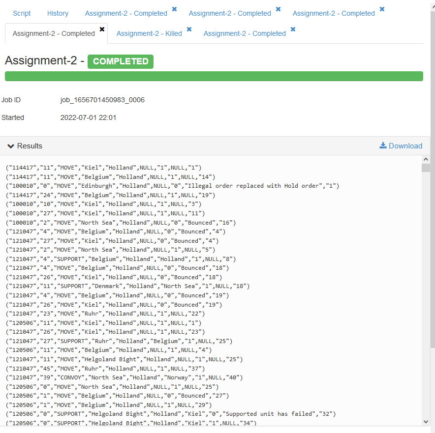
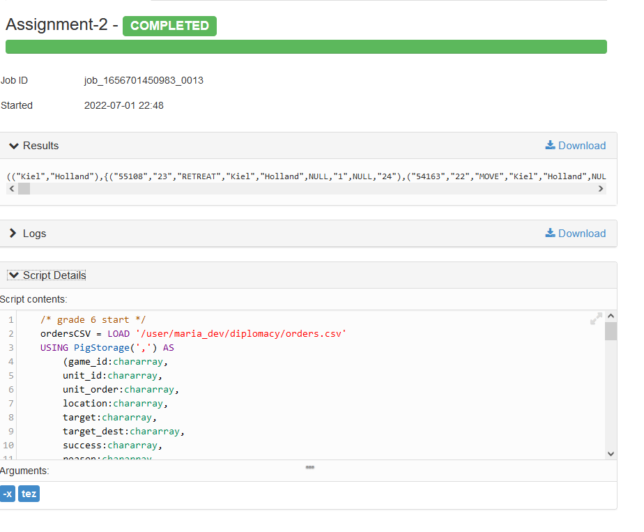
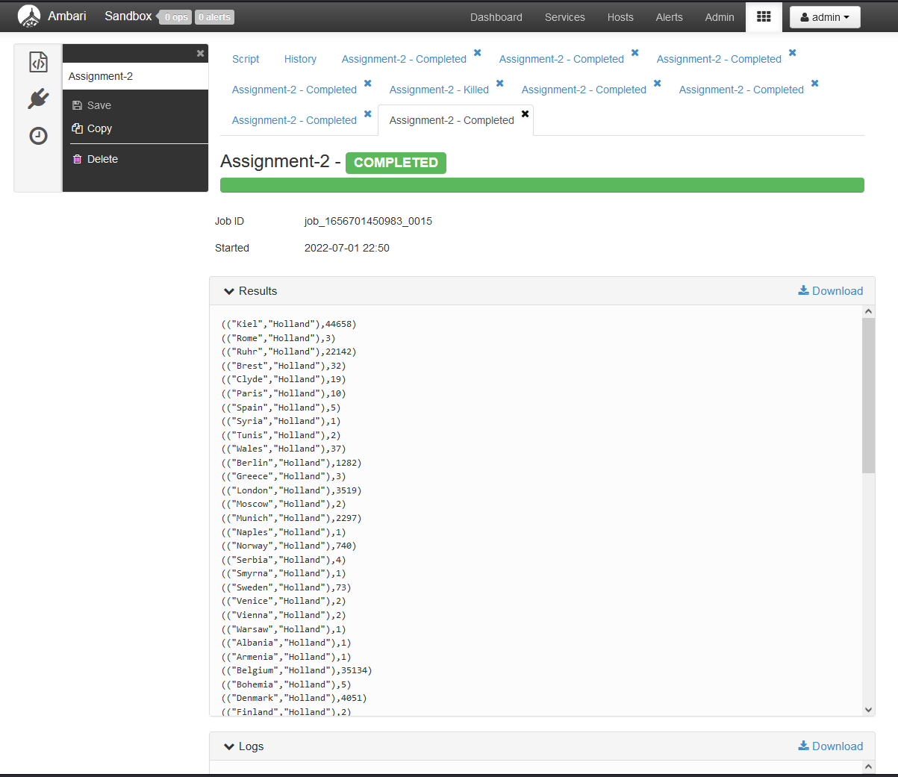
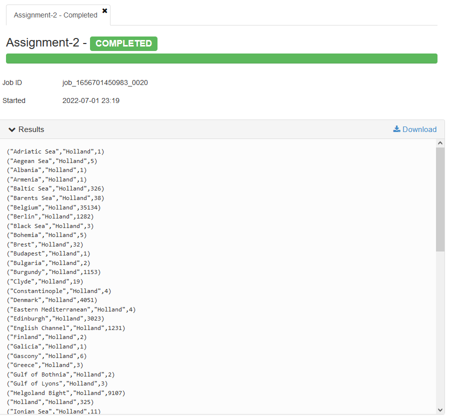

# <a name="title"></a>**Inholland-P4.4-Parallel-Distributed-Processing-Assignments**

## <a name="1."></a>**1. Student details**

|        |                                                                                          |
|:-------|:-----------------------------------------------------------------------------------------|
|Name:   |Jasper Stedema                                                                            |
|Number: |621642                                                                                    |
|Github: |<https://github.com/ditislol10/Inholland-P4.4-Parallel-Distributed-Processing-Assignments>|

## <a name="2."></a>**2. Code & Explanation**

### <a name="2.1."></a>**2.1. LOADING IN THE DATASET**

```SQL
/* LOADING IN THE DATASET */
-- the dataset is loaded in via CSV, making use of PigStorage to interpred the CSV into a usable dataset.
-- each column is assigned a name and datatype, which can be used to manipulate the data in the dataset.
ordersCSV = LOAD '/user/maria_dev/diplomacy/orders.csv'
USING PigStorage(',') AS
 (game_id:chararray,
    unit_id:chararray,
    unit_order:chararray,
    location:chararray,
    target:chararray,
    target_dest:chararray,
    success:chararray,
    reason:chararray,
    turn_num:chararray
);
```

### <a name="2.2."></a>**2.2. FILTERING OF THE DATASET**

```SQL
/*FILTERING OF THE DATASET*/
-- As the dataset has around 13million records, so it takes a really long time to process everything,
-- it is a better practise to first filter out the records needed.
-- And process everything from there.

-- The values in the records have the datatype chararray, as assigned above.
-- this filter searches for an exact match of type chararray,
-- since chararray is not a string, the quotes need to be explicitly specified
-- in order to find anything in the database.
filtered_data = FILTER ordersCSV BY target == '"Holland"';
```

### <a name="2.3."></a>**2.3. GROUPING OF THE FILTERED DATA**

```SQL
/*GROUPING OF THE FILTERED DATA*/
-- as we have already filterd the list down from 130million records to a sheer 68 records,
-- each with target '"Holland"', we are now going to group them. In order to reduce the list even further
grouped_filter_data = GROUP filtered_data BY (location, target);
```

### <a name="2.4."></a>**2.4. COUNTING OF THE GROUPED DATA**

```SQL
/*COUNTING OF THE GROUPED DATA*/
-- In order to know how many records there are in each group, we are going to count them,
-- this is done via a FOREACH loop, which iterates over every item assigned to a group.
-- Reducing the grouped records to their count.
-- the flatting of the group is, so we have an easier time sorting the data in the next step.
counted_group_data = FOREACH grouped_filter_data GENERATE FLATTEN(group) AS (location, target), COUNT(filtered_data);
```

### <a name="2.5."></a>**2.5. SORTING OF THE COUNTED DATA**

```SQL
/*SORTING OF THE COUNTED DATA*/
-- After each group is reduced the list needs to be sorted so it is better readable,
-- and better suitable for possible future processing.
ordered_count_data = ORDER counted_group_data BY location ASC;
```

### <a name="2.6."></a>**2.6. EXPORTING THE RESULT**

```SQL
/*EXPORTING THE RESULT*/
-- exporting the results are done with the command DUMP followed by the variable that needs to be exported.
DUMP ordered_count_data;
```


## <a name="3."></a>**3. Screenshots**

### <a name="3.1."></a>**3.1. LOADING IN THE DATASET**

13million records processing takes way too long, see filtering of the dataset for an exerpt of the dataset.

### <a name="3.2."></a>**3.2. FILTERING OF THE DATASET**



### <a name="3.3."></a>**3.3. GROUPING OF THE FILTERED DATA**



### <a name="3.4."></a>**3.4. COUNTING OF THE GROUPED DATA**



### <a name="3.5."></a>**3.5. SORTING OF THE COUNTED DATA**

See exporting the results down below.
<!--  -->

### <a name="3.6."></a>**3.6. EXPORTING THE RESULT**


